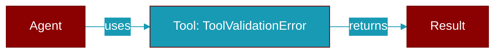

# ToolValidationError

> Defined in the [**base**](../modules/base) module.

<Badge color="blue">AI Agent</Badge>

Raised when a tool fails validation.

## Source

<Card title="View on GitHub" icon="github" href="https://github.com/MervinPraison/PraisonAI/blob/main/src/praisonai-agents/praisonaiagents/tools/base.py#L27">
  `praisonaiagents/tools/base.py` at line 27
</Card>

---

## Related Documentation

<CardGroup cols={2}>
  <Card title="Tools Concept" icon="wrench" href="/docs/concepts/tools" />
  <Card title="Create Custom Tools" icon="plus" href="/docs/guides/tools/create-custom-tools" />
  <Card title="Tool Development" icon="code" href="/docs/tutorials/advanced-tool-development" />
</CardGroup>
