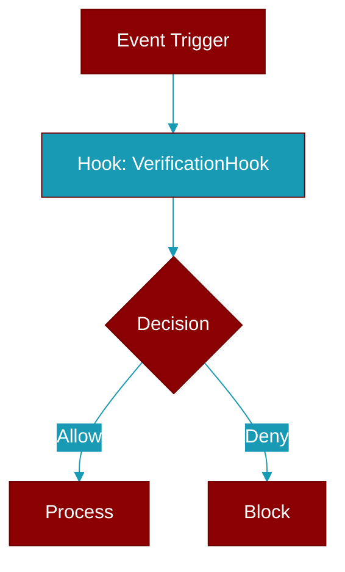

# VerificationHook

> Defined in the [**verification**](../modules/verification) module.

<Badge color="blue">AI Agent</Badge>

Protocol for verification hooks.

Verification hooks are used by Agent autonomy to validate actions.
They run after file writes or at configured checkpoints.

Implementations must provide:
- name: Unique identifier for the hook
- run(): Execute verification and return result



## Properties

<ResponseField name="name" type="str">
  No description available.
</ResponseField>

## Methods

<CardGroup cols={2}>
  <Card title="run()" icon="function" href="../functions/VerificationHook-run">
    Run the verification hook.
  </Card>
</CardGroup>

## Usage

```python
class LintRunner:
        name = "ruff"
        
        def run(self, context=None):
            import subprocess
            result = subprocess.run(["ruff", "check", "."], capture_output=True)
            return VerificationResult(
                success=result.returncode == 0,
                output=result.stdout.decode()
            )
```


---

## Related Documentation

<CardGroup cols={2}>
  <Card title="Hooks Concept" icon="anchor" href="/docs/concepts/hooks" />
  <Card title="Hook Events" icon="bolt" href="/docs/features/hook-events" />
  <Card title="Callbacks" icon="phone" href="/docs/features/callbacks" />
</CardGroup>
