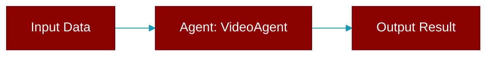

# VideoAgent

> Defined in the [**Video Agent**](../modules/video_agent) module.

<Badge color="blue">AI Agent</Badge>

A specialized agent for generating videos using AI models.

This agent provides a simple, agent-centric interface for video generation
with support for multiple providers (OpenAI Sora, Azure, Gemini Veo, Vertex AI, RunwayML).

Supported Providers:
    - OpenAI: openai/sora-2, openai/sora-2-pro
    - Azure: azure/sora-2, azure/sora-2-pro
    - Gemini: gemini/veo-3.0-generate-preview, gemini/veo-3.1-*
    - Vertex AI: vertex_ai/veo-3.0-*, vertex_ai/veo-3.1-*
    - RunwayML: runwayml/gen4_turbo (requires input_reference)



## Constructor

<ParamField query="name" type="Optional" required={false}>
  No description available.
</ParamField>

<ParamField query="instructions" type="Optional" required={false}>
  No description available.
</ParamField>

<ParamField query="llm" type="Optional" required={false}>
  No description available.
</ParamField>

<ParamField query="model" type="Optional" required={false}>
  No description available.
</ParamField>

<ParamField query="base_url" type="Optional" required={false}>
  No description available.
</ParamField>

<ParamField query="api_key" type="Optional" required={false}>
  No description available.
</ParamField>

<ParamField query="api_version" type="Optional" required={false}>
  No description available.
</ParamField>

<ParamField query="video" type="Optional" required={false}>
  No description available.
</ParamField>

<ParamField query="verbose" type="Union" required={false} default="True">
  No description available.
</ParamField>

<ParamField query="output" type="Optional" required={false}>
  No description available.
</ParamField>

## Methods

<CardGroup cols={2}>
  <Card title="console()" icon="function" href="../functions/VideoAgent-console">
    Lazily initialize Rich Console.
  </Card>
  <Card title="video_module()" icon="function" href="../functions/VideoAgent-video_module">
    Lazy load litellm.videos module when needed.
  </Card>
  <Card title="generate()" icon="function" href="../functions/VideoAgent-generate">
    Generate a video from a text prompt.
  </Card>
  <Card title="agenerate()" icon="function" href="../functions/VideoAgent-agenerate">
    Async version of generate().
  </Card>
  <Card title="status()" icon="function" href="../functions/VideoAgent-status">
    Check the status of a video generation.
  </Card>
  <Card title="astatus()" icon="function" href="../functions/VideoAgent-astatus">
    Async version of status().
  </Card>
  <Card title="content()" icon="function" href="../functions/VideoAgent-content">
    Download the video content.
  </Card>
  <Card title="acontent()" icon="function" href="../functions/VideoAgent-acontent">
    Async version of content().
  </Card>
  <Card title="list()" icon="function" href="../functions/VideoAgent-list">
    List all videos for the current account.
  </Card>
  <Card title="alist()" icon="function" href="../functions/VideoAgent-alist">
    Async version of list().
  </Card>
  <Card title="remix()" icon="function" href="../functions/VideoAgent-remix">
    Remix/edit an existing video.
  </Card>
  <Card title="aremix()" icon="function" href="../functions/VideoAgent-aremix">
    Async version of remix().
  </Card>
  <Card title="wait_for_completion()" icon="function" href="../functions/VideoAgent-wait_for_completion">
    Wait for video generation to complete.
  </Card>
  <Card title="await_completion()" icon="function" href="../functions/VideoAgent-await_completion">
    Async version of wait_for_completion().
  </Card>
  <Card title="start()" icon="function" href="../functions/VideoAgent-start">
    Generate video with optional wait and file output.
  </Card>
  <Card title="astart()" icon="function" href="../functions/VideoAgent-astart">
    Async version of start().
  </Card>
  <Card title="run()" icon="function" href="../functions/VideoAgent-run">
    Generate video silently (production use).
  </Card>
  <Card title="arun()" icon="function" href="../functions/VideoAgent-arun">
    Async version of run().
  </Card>
  <Card title="download()" icon="function" href="../functions/VideoAgent-download">
    Download a video to a file.
  </Card>
  <Card title="adownload()" icon="function" href="../functions/VideoAgent-adownload">
    Async version of download().
  </Card>
</CardGroup>

## Usage

```python
from praisonaiagents import VideoAgent
    
    # Simple usage
    agent = VideoAgent(llm="openai/sora-2")
    video = agent.generate(prompt="A cat playing with yarn")
    
    # Wait for completion
    video = agent.start(
        prompt="A serene lake at sunset",
        wait=True,  # Wait for completion
        output="video.mp4"  # Save to file
    )
    
    # With config
    agent = VideoAgent(
        llm="gemini/veo-3.0-generate-preview",
        video=VideoConfig(seconds="8", size="1280x720")
    )
```


---

## Related Documentation

<CardGroup cols={2}>
  <Card title="Agents Concept" icon="robot" href="/docs/concepts/agents" />
  <Card title="Single Agent Guide" icon="book-open" href="/docs/guides/single-agent" />
  <Card title="Multi-Agent Guide" icon="users" href="/docs/guides/multi-agent" />
  <Card title="Agent Configuration" icon="gear" href="/docs/configuration/agent-config" />
  <Card title="Auto Agents" icon="wand-magic-sparkles" href="/docs/features/autoagents" />
</CardGroup>
