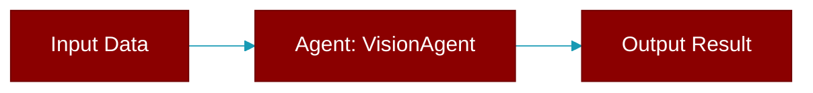

# VisionAgent

> Defined in the [**Vision Agent**](../modules/vision_agent) module.

<Badge color="blue">AI Agent</Badge>

A specialized agent for image analysis and understanding.

Provides:
- Image analysis and description
- Multi-image comparison
- Text extraction from images

Supported Providers:
    - OpenAI: `gpt-4o`, `gpt-4o-mini`, `gpt-4-turbo`
    - Anthropic: `claude-3-5-sonnet-20241022`, `claude-3-opus-20240229`
    - Google: `gemini/gemini-1.5-pro`, `gemini/gemini-1.5-flash`



## Constructor

<ParamField query="name" type="Optional" required={false}>
  No description available.
</ParamField>

<ParamField query="instructions" type="Optional" required={false}>
  No description available.
</ParamField>

<ParamField query="llm" type="Optional" required={false}>
  No description available.
</ParamField>

<ParamField query="model" type="Optional" required={false}>
  No description available.
</ParamField>

<ParamField query="base_url" type="Optional" required={false}>
  No description available.
</ParamField>

<ParamField query="api_key" type="Optional" required={false}>
  No description available.
</ParamField>

<ParamField query="vision" type="Optional" required={false}>
  No description available.
</ParamField>

<ParamField query="verbose" type="Union" required={false} default="True">
  No description available.
</ParamField>

## Methods

<CardGroup cols={2}>
  <Card title="console()" icon="function" href="../functions/VisionAgent-console">
    Lazily initialize Rich Console.
  </Card>
  <Card title="litellm()" icon="function" href="../functions/VisionAgent-litellm">
    Lazy load litellm module when needed.
  </Card>
  <Card title="analyze()" icon="function" href="../functions/VisionAgent-analyze">
    Analyze an image and return analysis.
  </Card>
  <Card title="describe()" icon="function" href="../functions/VisionAgent-describe">
    Generate a detailed description of an image.
  </Card>
  <Card title="compare()" icon="function" href="../functions/VisionAgent-compare">
    Compare multiple images.
  </Card>
  <Card title="extract_text()" icon="function" href="../functions/VisionAgent-extract_text">
    Extract text from an image (OCR-like functionality).
  </Card>
  <Card title="aanalyze()" icon="function" href="../functions/VisionAgent-aanalyze">
    Async version of analyze().
  </Card>
  <Card title="adescribe()" icon="function" href="../functions/VisionAgent-adescribe">
    Async version of describe().
  </Card>
  <Card title="acompare()" icon="function" href="../functions/VisionAgent-acompare">
    Async version of compare().
  </Card>
  <Card title="aextract_text()" icon="function" href="../functions/VisionAgent-aextract_text">
    Async version of extract_text().
  </Card>
</CardGroup>

## Usage

```python
from praisonaiagents import VisionAgent
    
    # Simple usage
    agent = VisionAgent()
    description = agent.describe("https://example.com/image.jpg")
    print(description)
    
    # Analyze with custom prompt
    result = agent.analyze(
        "https://example.com/chart.png",
        prompt="What data does this chart show?"
    )
    
    # Compare images
    comparison = agent.compare([
        "image1.jpg",
        "image2.jpg"
    ])
    
    # Extract text
    text = agent.extract_text("document.png")
```


---

## Related Documentation

<CardGroup cols={2}>
  <Card title="Agents Concept" icon="robot" href="/docs/concepts/agents" />
  <Card title="Single Agent Guide" icon="book-open" href="/docs/guides/single-agent" />
  <Card title="Multi-Agent Guide" icon="users" href="/docs/guides/multi-agent" />
  <Card title="Agent Configuration" icon="gear" href="/docs/configuration/agent-config" />
  <Card title="Auto Agents" icon="wand-magic-sparkles" href="/docs/features/autoagents" />
</CardGroup>
