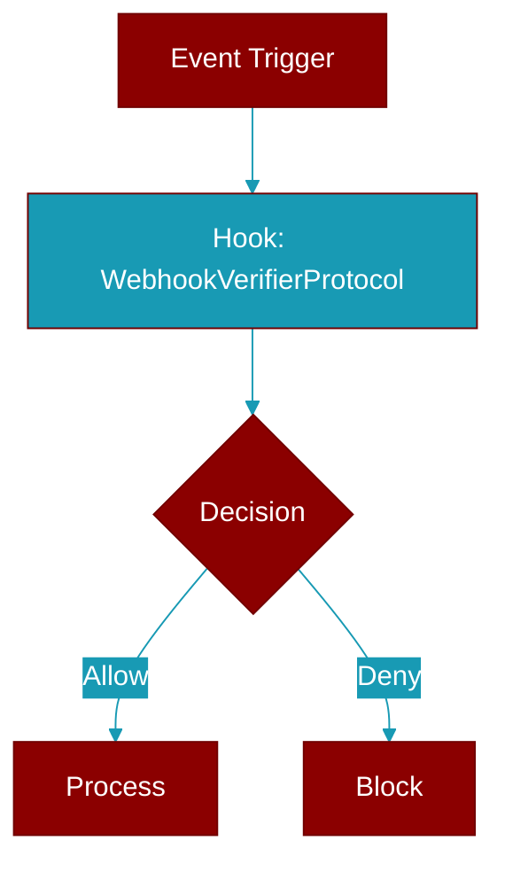

# WebhookVerifierProtocol

> Defined in the [**protocols**](../modules/protocols) module.

<Badge color="blue">AI Agent</Badge>

Protocol for verifying inbound webhook authenticity.

Internet-facing bot adapters (Slack, WhatsApp, Linear, AgentMail, …)
receive webhooks that must be authenticated before they become an agent
run. This protocol declares the contract so the wrapper ingress can
enforce verification centrally and fail-closed: an adapter that declares
``PlatformCapabilities.accepts_webhooks`` must expose a verifier and that
verifier must pass before dispatch.

Implementations live in the ``praisonai-bot`` package (``praisonai_bot.bots``) and
wrap an HMAC comparison over the raw request body.



## Methods

<CardGroup cols={2}>
  <Card title="verify()" icon="function" href="../functions/WebhookVerifierProtocol-verify">
    Return True if the inbound webhook is authentic.
  </Card>
</CardGroup>

## Usage

```python
class SlackVerifier:
        def verify(self, *, headers, raw_body):
            ...
```


## Source

<Card title="View on GitHub" icon="github" href="https://github.com/MervinPraison/PraisonAI/blob/main/src/praisonai-agents/praisonaiagents/bots/protocols.py#L273">
  `praisonaiagents/bots/protocols.py` at line 273
</Card>


---

## Related Documentation

<CardGroup cols={2}>
  <Card title="Hooks Concept" icon="anchor" href="/docs/concepts/hooks" />
  <Card title="Hook Events" icon="bolt" href="/docs/features/hook-events" />
  <Card title="Callbacks" icon="phone" href="/docs/features/callbacks" />
</CardGroup>
