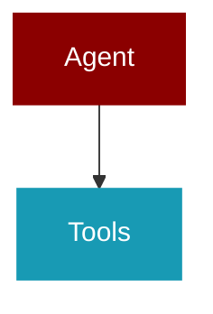

# feature_configs

<Badge color="blue">Core SDK</Badge>

## Overview



Feature Configuration Classes for PraisonAI Agents.

Provides dataclasses for consolidated feature configuration:
- MemoryConfig: Memory and session management
- KnowledgeConfig: RAG and knowledge retrieval
- PlanningConfig: Planning mode settings
- ReflectionConfig: Self-reflection settings
- GuardrailConfig: Safety and validation
- WebConfig: Web search and fetch

All configs follow the agent-centric pattern:
- False: Feature disabled (zero overhead)
- True: Feature enabled with safe defaults
- Config: Custom configuration
- Instance: Pre-configured manager/engine

Usage:
    from praisonaiagents import Agent, MemoryConfig, KnowledgeConfig
    
    # Simple enable
    agent = Agent(instructions="...", memory=True)
    
    # With config
    agent = Agent(
        instructions="...",
        memory=MemoryConfig(backend="redis", user_id="user123"),
        knowledge=KnowledgeConfig(sources=["docs/"], rerank=True),
    )

## Import

```python
from praisonaiagents import feature_configs
```

## Classes

<AccordionGroup>
### MemoryBackend

*Extends: str, Enum*

Memory storage backends.

### LearnScope

*Extends: str, Enum*

Scope for learning data visibility.

PRIVATE: Learning data is private to this user/agent (default, safest)
SHARED: Learning data is shared with all agents

### LearnConfig

Configuration for continuous learning within memory system.

Learning captures patterns, preferences, and insights from agent interactions
to improve future responses. All learning data is stored within the memory system.

Usage:
    # Simple enable
    Agent(memory=MemoryConfig(learn=True))
    
    # With specific capabilities
    Agent(memory=MemoryConfig(
        learn=LearnConfig(
            persona=True,      # User preferences
            insights=True,     # Observations
            patterns=True,     # Reusable knowledge
        )
    ))

<Expandable title="Properties">

<ResponseField name="persona" type="bool">
</ResponseField>
<ResponseField name="insights" type="bool">
</ResponseField>
<ResponseField name="thread" type="bool">
</ResponseField>
<ResponseField name="patterns" type="bool">
</ResponseField>
<ResponseField name="decisions" type="bool">
</ResponseField>
<ResponseField name="feedback" type="bool">
</ResponseField>
<ResponseField name="improvements" type="bool">
</ResponseField>
<ResponseField name="scope" type="Union">
</ResponseField>
<ResponseField name="store_path" type="Optional">
</ResponseField>
<ResponseField name="auto_consolidate" type="bool">
</ResponseField>
<ResponseField name="retention_days" type="Optional">
</ResponseField>

</Expandable>

<AccordionGroup>
<Accordion title="to_dict() -> Dict">
  Convert to dictionary.
</Accordion>
</AccordionGroup>

### MemoryConfig

Configuration for agent memory and session management.

Consolidates: memory, auto_memory, claude_memory, user_id, session_id, db, learn

Usage:
    # Simple enable (uses FileMemory)
    Agent(memory=True)
    
    # With backend
    Agent(memory=MemoryConfig(backend="redis"))
    
    # Full config with learning
    Agent(memory=MemoryConfig(
        backend="sqlite",
        user_id="user123",
        session_id="session456",
        auto_memory=True,
        learn=True,  # Enable continuous learning
    ))
    
    # With detailed learn config
    Agent(memory=MemoryConfig(
        learn=LearnConfig(
            persona=True,
            insights=True,
            patterns=True,
        )
    ))

<Expandable title="Properties">

<ResponseField name="backend" type="Union">
</ResponseField>
<ResponseField name="user_id" type="Optional">
</ResponseField>
<ResponseField name="session_id" type="Optional">
</ResponseField>
<ResponseField name="auto_memory" type="bool">
</ResponseField>
<ResponseField name="claude_memory" type="bool">
</ResponseField>
<ResponseField name="db" type="Optional">
</ResponseField>
<ResponseField name="config" type="Optional">
</ResponseField>
<ResponseField name="learn" type="Optional">
</ResponseField>

</Expandable>

<AccordionGroup>
<Accordion title="to_dict() -> Dict">
  Convert to dictionary.
</Accordion>
</AccordionGroup>

### ChunkingStrategy

*Extends: str, Enum*

Knowledge chunking strategies.

### KnowledgeConfig

Configuration for RAG and knowledge retrieval.

Consolidates: knowledge, retrieval_config, knowledge_config, rag_config, embedder_config

Usage:
    # Simple enable with sources
    Agent(knowledge=["docs/", "data.pdf"])
    
    # With config
    Agent(knowledge=KnowledgeConfig(
        sources=["docs/"],
        embedder="openai",
        chunking_strategy="semantic",
        retrieval_k=5,
        rerank=True,
    ))
    
    # With chunker config
    Agent(knowledge=&#123;
        "sources": ["docs/"],
        "chunker": &#123;
            "type": "semantic",
            "chunk_size": 512
        &#125;
    &#125;)

<Expandable title="Properties">

<ResponseField name="sources" type="List">
</ResponseField>
<ResponseField name="embedder" type="str">
</ResponseField>
<ResponseField name="embedder_config" type="Optional">
</ResponseField>
<ResponseField name="chunking_strategy" type="Union">
</ResponseField>
<ResponseField name="chunk_size" type="int">
</ResponseField>
<ResponseField name="chunk_overlap" type="int">
</ResponseField>
<ResponseField name="chunker" type="Optional">
</ResponseField>
<ResponseField name="retrieval_k" type="int">
</ResponseField>
<ResponseField name="retrieval_threshold" type="float">
</ResponseField>
<ResponseField name="rerank" type="bool">
</ResponseField>
<ResponseField name="rerank_model" type="Optional">
</ResponseField>
<ResponseField name="auto_retrieve" type="bool">
</ResponseField>
<ResponseField name="vector_store" type="Optional">
</ResponseField>
<ResponseField name="config" type="Optional">
</ResponseField>

</Expandable>

<AccordionGroup>
<Accordion title="to_dict() -> Dict">
  Convert to dictionary.
</Accordion>
</AccordionGroup>

### PlanningConfig

Configuration for planning mode.

Consolidates: planning, plan_mode, planning_tools, planning_reasoning, planning_llm

Usage:
    # Simple enable
    Agent(planning=True)
    
    # With config
    Agent(planning=PlanningConfig(
        llm="gpt-4o",
        tools=[search_tool],
        reasoning=True,
        auto_approve=False,
    ))

<Expandable title="Properties">

<ResponseField name="llm" type="Optional">
</ResponseField>
<ResponseField name="tools" type="Optional">
</ResponseField>
<ResponseField name="reasoning" type="bool">
</ResponseField>
<ResponseField name="auto_approve" type="bool">
</ResponseField>
<ResponseField name="read_only" type="bool">
</ResponseField>

</Expandable>

<AccordionGroup>
<Accordion title="to_dict() -> Dict">
  Convert to dictionary.
</Accordion>
</AccordionGroup>

### ReflectionConfig

Configuration for self-reflection.

Consolidates: self_reflect, max_reflect, min_reflect, reflect_llm, reflect_prompt

Usage:
    # Simple enable
    Agent(reflection=True)
    
    # With config
    Agent(reflection=ReflectionConfig(
        min_iterations=1,
        max_iterations=3,
        llm="gpt-4o",
        prompt="Evaluate your response for accuracy...",
    ))

<Expandable title="Properties">

<ResponseField name="min_iterations" type="int">
</ResponseField>
<ResponseField name="max_iterations" type="int">
</ResponseField>
<ResponseField name="llm" type="Optional">
</ResponseField>
<ResponseField name="prompt" type="Optional">
</ResponseField>

</Expandable>

<AccordionGroup>
<Accordion title="to_dict() -> Dict">
  Convert to dictionary.
</Accordion>
</AccordionGroup>

### GuardrailAction

*Extends: str, Enum*

Action to take when guardrail fails.

### GuardrailConfig

Configuration for guardrails and safety validation.

Consolidates: guardrail, max_guardrail_retries, policy

Usage:
    # With validator function
    Agent(guardrails=my_validator_fn)
    
    # With string preset
    Agent(guardrails="strict")  # Uses strict preset
    
    # With policy strings
    Agent(guardrails=["policy:strict", "pii:redact"])
    
    # With config
    Agent(guardrails=GuardrailConfig(
        validator=my_validator_fn,
        max_retries=3,
        on_fail="retry",
    ))
    
    # With LLM-based validation
    Agent(guardrails=GuardrailConfig(
        llm_validator="Ensure response is helpful and safe",
        max_retries=2,
    ))

<Expandable title="Properties">

<ResponseField name="validator" type="Optional">
</ResponseField>
<ResponseField name="llm_validator" type="Optional">
</ResponseField>
<ResponseField name="max_retries" type="int">
</ResponseField>
<ResponseField name="on_fail" type="Union">
</ResponseField>
<ResponseField name="policy" type="Optional">
</ResponseField>
<ResponseField name="policies" type="List">
</ResponseField>

</Expandable>

<AccordionGroup>
<Accordion title="to_dict() -> Dict">
  Convert to dictionary.
</Accordion>
</AccordionGroup>

### WebSearchProvider

*Extends: str, Enum*

Web search providers.

### WebConfig

Configuration for web search and fetch capabilities.

Consolidates: web_search, web_fetch

Usage:
    # Simple enable
    Agent(web=True)
    
    # With config
    Agent(web=WebConfig(
        search=True,
        fetch=True,
        search_provider="duckduckgo",
        max_results=5,
    ))

<Expandable title="Properties">

<ResponseField name="search" type="bool">
</ResponseField>
<ResponseField name="fetch" type="bool">
</ResponseField>
<ResponseField name="search_provider" type="Union">
</ResponseField>
<ResponseField name="max_results" type="int">
</ResponseField>
<ResponseField name="search_config" type="Optional">
</ResponseField>
<ResponseField name="fetch_config" type="Optional">
</ResponseField>

</Expandable>

<AccordionGroup>
<Accordion title="to_dict() -> Dict">
  Convert to dictionary.
</Accordion>
</AccordionGroup>

### OutputPreset

*Extends: str, Enum*

Output style presets.

### OutputConfig

Configuration for agent output behavior.

Consolidates: verbose, markdown, stream, metrics, reasoning_steps, output_style

DEFAULT: output="silent" (zero overhead, fastest performance)

Usage:
    # Default is silent mode (no output overhead, programmatic use)
    Agent(instructions="...")  # Uses output="silent"
    
    # Actions mode (tool calls + final output trace)
    Agent(output="actions")
    
    # Verbose mode with Rich panels
    Agent(output="verbose")
    
    # JSON mode for piping
    Agent(output="json")
    
    # With config
    Agent(output=OutputConfig(
        verbose=True,
        markdown=True,
        stream=True,
        metrics=True,
        reasoning_steps=True,
    ))

<Expandable title="Properties">

<ResponseField name="verbose" type="bool">
</ResponseField>
<ResponseField name="markdown" type="bool">
</ResponseField>
<ResponseField name="stream" type="bool">
</ResponseField>
<ResponseField name="metrics" type="bool">
</ResponseField>
<ResponseField name="reasoning_steps" type="bool">
</ResponseField>
<ResponseField name="style" type="Optional">
</ResponseField>
<ResponseField name="actions_trace" type="bool">
</ResponseField>
<ResponseField name="json_output" type="bool">
</ResponseField>
<ResponseField name="simple_output" type="bool">
</ResponseField>
<ResponseField name="show_parameters" type="bool">
</ResponseField>
<ResponseField name="status_trace" type="bool">
</ResponseField>

</Expandable>

<AccordionGroup>
<Accordion title="to_dict() -> Dict">
  Convert to dictionary.
</Accordion>
</AccordionGroup>

### ExecutionPreset

*Extends: str, Enum*

Execution mode presets.

### ExecutionConfig

Configuration for agent execution limits.

Consolidates: max_iter, max_rpm, max_execution_time, max_retry_limit

Usage:
    # Simple preset
    Agent(execution="thorough")
    
    # With config
    Agent(execution=ExecutionConfig(
        max_iter=50,
        max_rpm=100,
        max_execution_time=300,
        max_retry_limit=5,
    ))

<Expandable title="Properties">

<ResponseField name="max_iter" type="int">
</ResponseField>
<ResponseField name="max_rpm" type="Optional">
</ResponseField>
<ResponseField name="max_execution_time" type="Optional">
</ResponseField>
<ResponseField name="max_retry_limit" type="int">
</ResponseField>

</Expandable>

<AccordionGroup>
<Accordion title="to_dict() -> Dict">
  Convert to dictionary.
</Accordion>
</AccordionGroup>

### TemplateConfig

Configuration for prompt templates.

Consolidates: system_template, prompt_template, response_template, use_system_prompt

Usage:
    Agent(templates=TemplateConfig(
        system="You are a helpful assistant...",
        prompt="User query: &#123;input&#125;",
        response="Response format...",
        use_system_prompt=True,
    ))

<Expandable title="Properties">

<ResponseField name="system" type="Optional">
</ResponseField>
<ResponseField name="prompt" type="Optional">
</ResponseField>
<ResponseField name="response" type="Optional">
</ResponseField>
<ResponseField name="use_system_prompt" type="bool">
</ResponseField>

</Expandable>

<AccordionGroup>
<Accordion title="to_dict() -> Dict">
  Convert to dictionary.
</Accordion>
</AccordionGroup>

### CachingConfig

Configuration for caching behavior.

Consolidates: cache, prompt_caching

Usage:
    # Simple enable
    Agent(caching=True)
    
    # With config
    Agent(caching=CachingConfig(
        enabled=True,
        prompt_caching=True,
    ))

<Expandable title="Properties">

<ResponseField name="enabled" type="bool">
</ResponseField>
<ResponseField name="prompt_caching" type="Optional">
</ResponseField>

</Expandable>

<AccordionGroup>
<Accordion title="to_dict() -> Dict">
  Convert to dictionary.
</Accordion>
</AccordionGroup>

### HooksConfig

Configuration for agent hooks/callbacks.

Consolidates: hooks, step_callback

Usage:
    Agent(hooks=HooksConfig(
        on_step=my_step_callback,
        on_tool_call=my_tool_callback,
        middleware=[my_middleware],
    ))

<Expandable title="Properties">

<ResponseField name="on_step" type="Optional">
</ResponseField>
<ResponseField name="on_tool_call" type="Optional">
</ResponseField>
<ResponseField name="middleware" type="List">
</ResponseField>

</Expandable>

<AccordionGroup>
<Accordion title="to_dict() -> Dict">
  Convert to dictionary.
</Accordion>
</AccordionGroup>

### SkillsConfig

Configuration for agent skills.

Consolidates: skills, skills_dirs

Usage:
    # Simple list
    Agent(skills=["./my-skill", "code-review"])
    
    # With config
    Agent(skills=SkillsConfig(
        paths=["./my-skill"],
        dirs=["~/.praison/skills/"],
        auto_discover=True,
    ))

<Expandable title="Properties">

<ResponseField name="paths" type="List">
</ResponseField>
<ResponseField name="dirs" type="List">
</ResponseField>
<ResponseField name="auto_discover" type="bool">
</ResponseField>

</Expandable>

<AccordionGroup>
<Accordion title="to_dict() -> Dict">
  Convert to dictionary.
</Accordion>
</AccordionGroup>

### MultiAgentHooksConfig

Configuration for multi-agent orchestration hooks/callbacks.

Consolidates: completion_checker, on_task_start, on_task_complete

Usage:
    Agents(
        agents=[...],
        hooks=MultiAgentHooksConfig(
            on_task_start=my_start_callback,
            on_task_complete=my_complete_callback,
            completion_checker=my_checker,
        )
    )

<Expandable title="Properties">

<ResponseField name="on_task_start" type="Optional">
</ResponseField>
<ResponseField name="on_task_complete" type="Optional">
</ResponseField>
<ResponseField name="completion_checker" type="Optional">
</ResponseField>

</Expandable>

<AccordionGroup>
<Accordion title="to_dict() -> Dict">
  Convert to dictionary.
</Accordion>
</AccordionGroup>

### MultiAgentOutputConfig

Configuration for multi-agent output behavior.

Consolidates: verbose, stream

Usage:
    # Simple preset
    Agents(agents=[...], output="verbose")
    
    # With config
    Agents(
        agents=[...],
        output=MultiAgentOutputConfig(verbose=2, stream=True)
    )

<Expandable title="Properties">

<ResponseField name="verbose" type="int">
</ResponseField>
<ResponseField name="stream" type="bool">
</ResponseField>

</Expandable>

<AccordionGroup>
<Accordion title="to_dict() -> Dict">
  Convert to dictionary.
</Accordion>
</AccordionGroup>

### MultiAgentExecutionConfig

Configuration for multi-agent execution limits.

Consolidates: max_iter, max_retries

Usage:
    Agents(
        agents=[...],
        execution=MultiAgentExecutionConfig(max_iter=20, max_retries=5)
    )

<Expandable title="Properties">

<ResponseField name="max_iter" type="int">
</ResponseField>
<ResponseField name="max_retries" type="int">
</ResponseField>

</Expandable>

<AccordionGroup>
<Accordion title="to_dict() -> Dict">
  Convert to dictionary.
</Accordion>
</AccordionGroup>

### MultiAgentPlanningConfig

Configuration for multi-agent planning mode.

Consolidates: planning, planning_llm, auto_approve_plan, planning_tools, planning_reasoning

Usage:
    # Simple enable
    Agents(agents=[...], planning=True)
    
    # With config
    Agents(
        agents=[...],
        planning=MultiAgentPlanningConfig(
            llm="gpt-4o",
            auto_approve=True,
            reasoning=True,
        )
    )

<Expandable title="Properties">

<ResponseField name="llm" type="Optional">
</ResponseField>
<ResponseField name="auto_approve" type="bool">
</ResponseField>
<ResponseField name="tools" type="Optional">
</ResponseField>
<ResponseField name="reasoning" type="bool">
</ResponseField>

</Expandable>

<AccordionGroup>
<Accordion title="to_dict() -> Dict">
  Convert to dictionary.
</Accordion>
</AccordionGroup>

### MultiAgentMemoryConfig

Configuration for multi-agent shared memory.

Consolidates: memory, memory_config, embedder, user_id

Usage:
    # Simple enable
    Agents(agents=[...], memory=True)
    
    # With config
    Agents(
        agents=[...],
        memory=MultiAgentMemoryConfig(
            user_id="user123",
            embedder=&#123;"provider": "openai"&#125;,
            config=&#123;"provider": "rag"&#125;,
        )
    )

<Expandable title="Properties">

<ResponseField name="user_id" type="Optional">
</ResponseField>
<ResponseField name="embedder" type="Optional">
</ResponseField>
<ResponseField name="config" type="Optional">
</ResponseField>

</Expandable>

<AccordionGroup>
<Accordion title="to_dict() -> Dict">
  Convert to dictionary.
</Accordion>
</AccordionGroup>

### AutonomyLevel

*Extends: str, Enum*

Autonomy levels for agent behavior.

### AutonomyConfig

Configuration for agent autonomy behavior.

Controls escalation, doom-loop detection, and approval policies.

Usage:
    # Simple enable
    Agent(autonomy=True)
    
    # With config
    Agent(autonomy=AutonomyConfig(
        level="auto_edit",
        escalation_enabled=True,
        doom_loop_detection=True,
        max_consecutive_failures=3,
    ))

<Expandable title="Properties">

<ResponseField name="level" type="Union">
</ResponseField>
<ResponseField name="escalation_enabled" type="bool">
</ResponseField>
<ResponseField name="escalation_threshold" type="int">
</ResponseField>
<ResponseField name="doom_loop_detection" type="bool">
</ResponseField>
<ResponseField name="max_consecutive_failures" type="int">
</ResponseField>
<ResponseField name="require_approval_for_writes" type="bool">
</ResponseField>
<ResponseField name="require_approval_for_shell" type="bool">
</ResponseField>

</Expandable>

<AccordionGroup>
<Accordion title="to_dict() -> Dict">
  Convert to dictionary.
</Accordion>
</AccordionGroup>

</AccordionGroup>

## Functions

<AccordionGroup>
### resolve_memory()

Resolve memory= parameter following precedence ladder.

Precedence: Instance &gt; Config &gt; Dict &gt; String &gt; Bool &gt; Default

Args:
    value: Memory parameter in any supported form
    
Returns:
    MemoryConfig if enabled, None if disabled
    
Examples:
    &gt;&gt;&gt; resolve_memory(None)  # Default: disabled
    None
    &gt;&gt;&gt; resolve_memory(False)  # Explicit disable
    None
    &gt;&gt;&gt; resolve_memory(True)  # Enable with defaults
    MemoryConfig(backend='file')
    &gt;&gt;&gt; resolve_memory("redis")  # String shorthand
    MemoryConfig(backend='redis')
    &gt;&gt;&gt; resolve_memory(&#123;"backend": "sqlite", "user_id": "alice"&#125;)  # Dict
    MemoryConfig(backend='sqlite', user_id='alice')
    &gt;&gt;&gt; resolve_memory(MemoryConfig(backend="postgres"))  # Config passthrough
    MemoryConfig(backend='postgres')

```python
def resolve_memory(value: MemoryParam) -> Optional
```

<Expandable title="Parameters">

<ParamField query="value" type="MemoryParam">
</ParamField>

</Expandable>

### resolve_knowledge()

Resolve knowledge= parameter following precedence ladder.

Precedence: Instance &gt; Config &gt; Array &gt; Dict &gt; String &gt; Bool &gt; Default

Args:
    value: Knowledge parameter in any supported form
    
Returns:
    KnowledgeConfig if enabled, None if disabled

```python
def resolve_knowledge(value: KnowledgeParam) -> Optional
```

<Expandable title="Parameters">

<ParamField query="value" type="KnowledgeParam">
</ParamField>

</Expandable>

### resolve_planning()

Resolve planning= parameter following precedence ladder.

```python
def resolve_planning(value: PlanningParam) -> Optional
```

<Expandable title="Parameters">

<ParamField query="value" type="PlanningParam">
</ParamField>

</Expandable>

### resolve_reflection()

Resolve reflection= parameter following precedence ladder.

```python
def resolve_reflection(value: ReflectionParam) -> Optional
```

<Expandable title="Parameters">

<ParamField query="value" type="ReflectionParam">
</ParamField>

</Expandable>

### resolve_guardrails()

Resolve guardrails= parameter following precedence ladder.

```python
def resolve_guardrails(value: GuardrailParam) -> Optional
```

<Expandable title="Parameters">

<ParamField query="value" type="GuardrailParam">
</ParamField>

</Expandable>

### resolve_web()

Resolve web= parameter following precedence ladder.

```python
def resolve_web(value: WebParam) -> Optional
```

<Expandable title="Parameters">

<ParamField query="value" type="WebParam">
</ParamField>

</Expandable>

### resolve_output()

Resolve output= parameter following precedence ladder.

```python
def resolve_output(value: OutputParam) -> Optional
```

<Expandable title="Parameters">

<ParamField query="value" type="OutputParam">
</ParamField>

</Expandable>

### resolve_execution()

Resolve execution= parameter following precedence ladder.

```python
def resolve_execution(value: ExecutionParam) -> Optional
```

<Expandable title="Parameters">

<ParamField query="value" type="ExecutionParam">
</ParamField>

</Expandable>

### resolve_caching()

Resolve caching= parameter following precedence ladder.

```python
def resolve_caching(value: CachingParam) -> Optional
```

<Expandable title="Parameters">

<ParamField query="value" type="CachingParam">
</ParamField>

</Expandable>

### resolve_autonomy()

Resolve autonomy= parameter following precedence ladder.

```python
def resolve_autonomy(value: AutonomyParam) -> Optional
```

<Expandable title="Parameters">

<ParamField query="value" type="AutonomyParam">
</ParamField>

</Expandable>

</AccordionGroup>
