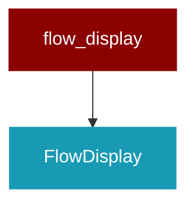

# flow_display

<Badge color="blue">Core SDK</Badge>

## Overview



Flow Display for PraisonAI Agents

Visual display with agents in center and tools on sides.

## Import

```python
from praisonaiagents import flow_display
```

## Classes

<AccordionGroup>
### FlowDisplay

Displays agent workflow with agents centered and tools on sides.

<AccordionGroup>
<Accordion title="start() -> Any">
  Start tracking workflow.
</Accordion>
<Accordion title="stop() -> Any">
  Stop tracking and display the flow.
</Accordion>
<Accordion title="display() -> Any">
  Display the flow chart with agents in center and tools on sides.
</Accordion>
</AccordionGroup>

</AccordionGroup>

## Functions

<AccordionGroup>
### track_workflow()

Create a flow display tracker.

```python
def track_workflow() -> Any
```

</AccordionGroup>
