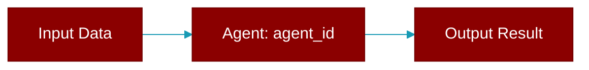

# agent_id

<div className="flex items-center gap-2">
  <Badge color="purple">Method</Badge>
</div>

> This is a method of the [**Agent**](../classes/Agent) class in the [**agent**](../modules/agent) module.

Lazily generate agent ID when first accessed.



## Signature

```python
def agent_id() -> Any
```

### Returns

<ResponseField name="Returns" type="Any">
  The result of the operation.
</ResponseField>
