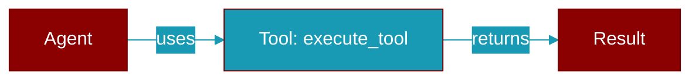

# execute_tool

<div className="flex items-center gap-2">
  <Badge color="purple">Method</Badge>
</div>

> This is a method of the [**Agent**](../classes/Agent) class in the [**agent**](../modules/agent) module.

Execute a tool dynamically based on the function name and arguments.
Injects agent state for tools with Injected[T] parameters.



## Signature

```python
def execute_tool(function_name: Any, arguments: Any) -> Any
```

## Parameters

<ParamField query="function_name" type="Any" required={true}>
  No description available.
</ParamField>

<ParamField query="arguments" type="Any" required={true}>
  No description available.
</ParamField>

### Returns

<ResponseField name="Returns" type="Any">
  The result of the operation.
</ResponseField>
