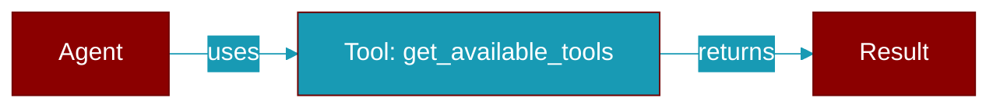

# get_available_tools

<div className="flex items-center gap-2">
  <Badge color="purple">Method</Badge>
</div>

> This is a method of the [**Agent**](../classes/Agent) class in the [**agent**](../modules/agent) module.

Get tools available to this agent, filtered by plan_mode if enabled.

In plan_mode, only read-only tools are available to prevent
modifications during the planning phase.



## Signature

```python
def get_available_tools() -> List[Any]
```

### Returns

<ResponseField name="Returns" type="List[Any]">
  List of available tools
</ResponseField>


---

## Related Documentation

<CardGroup cols={2}>
  <Card title="Tools Concept" icon="wrench" href="/docs/concepts/tools" />
  <Card title="Create Custom Tools" icon="plus" href="/docs/guides/tools/create-custom-tools" />
  <Card title="Tool Development" icon="code" href="/docs/tutorials/advanced-tool-development" />
</CardGroup>
