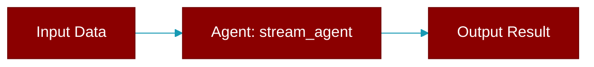

# stream_agent

<div className="flex items-center gap-2">
  <Badge color="blue">Async</Badge>
  <Badge color="purple">Method</Badge>
</div>

> This is a method of the [**AgentRuntimeProtocol**](../classes/AgentRuntimeProtocol) class in the [**protocols**](../modules/protocols) module.

Execute agent with streaming responses.

Only required if runtime declares streaming_deltas capability.



## Signature

```python
async def stream_agent(agent_config: Dict[str, Any], prompt: str) -> Any
```

## Parameters

<ParamField query="agent_config" type="Dict[str, Any]" required={true}>
  Agent configuration dict 
</ParamField>

<ParamField query="prompt" type="str" required={true}>
  User prompt to process **kwargs: Additional execution parameters Streaming response chunks
</ParamField>

### Returns

<ResponseField name="Returns" type="Any">
  The result of the operation.
</ResponseField>


## Source

<Card title="View on GitHub" icon="github" href="https://github.com/MervinPraison/PraisonAI/blob/main/src/praisonai-agents/praisonaiagents/runtime/protocols.py#L270">
  `praisonaiagents/runtime/protocols.py` at line 270
</Card>


---

## Related Documentation

<CardGroup cols={2}>
  <Card title="Agents Concept" icon="robot" href="/docs/concepts/agents" />
  <Card title="Single Agent Guide" icon="book-open" href="/docs/guides/single-agent" />
  <Card title="Multi-Agent Guide" icon="users" href="/docs/guides/multi-agent" />
  <Card title="Agent Configuration" icon="gear" href="/docs/configuration/agent-config" />
  <Card title="Auto Agents" icon="wand-magic-sparkles" href="/docs/features/autoagents" />
</CardGroup>
