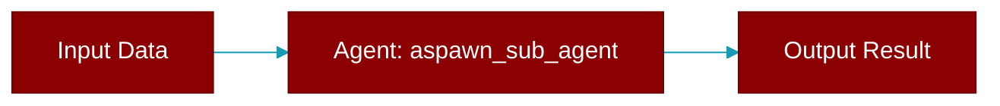

# aspawn_sub_agent

<div className="flex items-center gap-2">
  <Badge color="blue">Async</Badge>
  <Badge color="purple">Method</Badge>
</div>

> This is a method of the [**AgentTeam**](../classes/AgentTeam) class in the [**agents**](../modules/agents) module.

Async version of spawn_sub_agent using asyncio primitives.



## Signature

```python
async def aspawn_sub_agent(agent: Agent, task: Any, completion_callback: Optional[Callable[[SubAgentCompletionEvent], Any]], metadata: Optional[Dict[str, Any]]) -> SpawnedSubAgent
```

## Parameters

<ParamField query="agent" type="Agent" required={true}>
  No description available.
</ParamField>

<ParamField query="task" type="Any" required={true}>
  No description available.
</ParamField>

<ParamField query="completion_callback" type="Optional" required={false}>
  No description available.
</ParamField>

<ParamField query="metadata" type="Optional" required={false}>
  No description available.
</ParamField>

### Returns

<ResponseField name="Returns" type="SpawnedSubAgent">
  The result of the operation.
</ResponseField>


## Uses

- `asyncio.Lock`
- `uuid.uuid4`
- `EventBus`
- `subscribe`
- `SpawnedSubAgent`
- `time.time`
- `publish`
- `agent.astart`
- `aannounce_completion`
- `logger.warning`


## Source

<Card title="View on GitHub" icon="github" href="https://github.com/MervinPraison/PraisonAI/blob/main/src/praisonai-agents/praisonaiagents/agents/agents.py#L3616">
  `praisonaiagents/agents/agents.py` at line 3616
</Card>


---

## Related Documentation

<CardGroup cols={2}>
  <Card title="Agents Concept" icon="robot" href="/docs/concepts/agents" />
  <Card title="Single Agent Guide" icon="book-open" href="/docs/guides/single-agent" />
  <Card title="Multi-Agent Guide" icon="users" href="/docs/guides/multi-agent" />
  <Card title="Agent Configuration" icon="gear" href="/docs/configuration/agent-config" />
  <Card title="Auto Agents" icon="wand-magic-sparkles" href="/docs/features/autoagents" />
</CardGroup>
