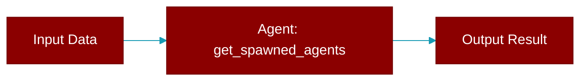

# get_spawned_agents

<div className="flex items-center gap-2">
  <Badge color="purple">Method</Badge>
</div>

> This is a method of the [**AgentTeam**](../classes/AgentTeam) class in the [**agents**](../modules/agents) module.

Get list of currently spawned sub-agents.



## Signature

```python
def get_spawned_agents() -> List[SpawnedSubAgent]
```

### Returns

<ResponseField name="Returns" type="List[SpawnedSubAgent]">
  The result of the operation.
</ResponseField>


## Source

<Card title="View on GitHub" icon="github" href="https://github.com/MervinPraison/PraisonAI/blob/main/src/praisonai-agents/praisonaiagents/agents/agents.py#L3292">
  `praisonaiagents/agents/agents.py` at line 3292
</Card>


---

## Related Documentation

<CardGroup cols={2}>
  <Card title="Agents Concept" icon="robot" href="/docs/concepts/agents" />
  <Card title="Single Agent Guide" icon="book-open" href="/docs/guides/single-agent" />
  <Card title="Multi-Agent Guide" icon="users" href="/docs/guides/multi-agent" />
  <Card title="Agent Configuration" icon="gear" href="/docs/configuration/agent-config" />
  <Card title="Auto Agents" icon="wand-magic-sparkles" href="/docs/features/autoagents" />
</CardGroup>
