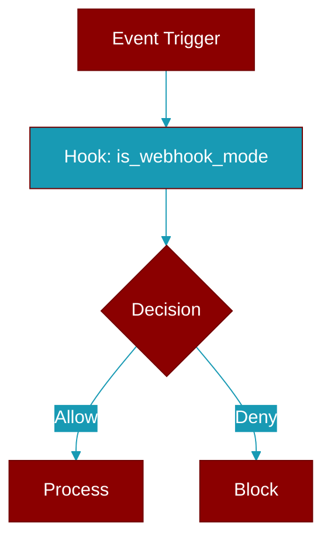

# is_webhook_mode

<div className="flex items-center gap-2">
  <Badge color="purple">Method</Badge>
</div>

> This is a method of the [**BotConfig**](../classes/BotConfig) class in the [**config**](../modules/config) module.

Whether bot is configured for webhook mode.



## Signature

```python
def is_webhook_mode() -> bool
```

### Returns

<ResponseField name="Returns" type="bool">
  The result of the operation.
</ResponseField>
