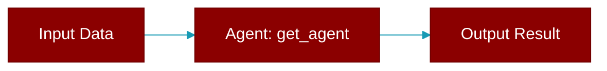

# get_agent

<div className="flex items-center gap-2">
  <Badge color="purple">Method</Badge>
</div>

> This is a method of the [**BotProtocol**](../classes/BotProtocol) class in the [**protocols**](../modules/protocols) module.

Get the current agent.



## Signature

```python
def get_agent() -> Optional['Agent']
```

### Returns

<ResponseField name="Returns" type="Optional['Agent']">
  The result of the operation.
</ResponseField>
