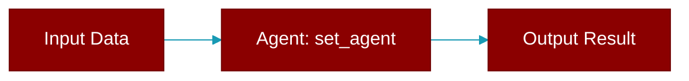

# set_agent

<div className="flex items-center gap-2">
  <Badge color="purple">Method</Badge>
</div>

> This is a method of the [**BotProtocol**](../classes/BotProtocol) class in the [**protocols**](../modules/protocols) module.

Set the agent that handles messages.



## Signature

```python
def set_agent(agent: 'Agent') -> None
```

## Parameters

<ParamField query="agent" type="Agent" required={true}>
  The agent to handle incoming messages
</ParamField>
