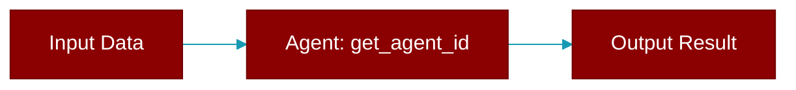

# get_agent_id

<div className="flex items-center gap-2">
  <Badge color="purple">Method</Badge>
</div>

> This is a method of the [**ChannelRouteConfig**](../classes/ChannelRouteConfig) class in the [**config**](../modules/config) module.

Resolve agent ID for a given message context.



## Signature

```python
def get_agent_id(context: str) -> str
```

## Parameters

<ParamField query="context" type="str" required={false} default="'default'">
  Message context (dm, group, channel, default)
</ParamField>

### Returns

<ResponseField name="Returns" type="str">
  The agent ID for the given context, falling back to "default" route.
</ResponseField>


## Source

<Card title="View on GitHub" icon="github" href="https://github.com/MervinPraison/PraisonAI/blob/main/src/praisonai-agents/praisonaiagents/gateway/config.py#L950">
  `praisonaiagents/gateway/config.py` at line 950
</Card>


---

## Related Documentation

<CardGroup cols={2}>
  <Card title="Agents Concept" icon="robot" href="/docs/concepts/agents" />
  <Card title="Single Agent Guide" icon="book-open" href="/docs/guides/single-agent" />
  <Card title="Multi-Agent Guide" icon="users" href="/docs/guides/multi-agent" />
  <Card title="Agent Configuration" icon="gear" href="/docs/configuration/agent-config" />
  <Card title="Auto Agents" icon="wand-magic-sparkles" href="/docs/features/autoagents" />
</CardGroup>
