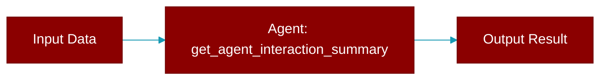

# get_agent_interaction_summary

<div className="flex items-center gap-2">
  <Badge color="purple">Method</Badge>
</div>

> This is a method of the [**ContextAgent**](../classes/ContextAgent) class in the [**context_agent**](../modules/context_agent) module.

Get summary of all agent interactions.



## Signature

```python
def get_agent_interaction_summary() -> Dict[str, Any]
```

### Returns

<ResponseField name="Returns" type="Dict[str, Any]">
  The result of the operation.
</ResponseField>


---

## Related Documentation

<CardGroup cols={2}>
  <Card title="Agents Concept" icon="robot" href="/docs/concepts/agents" />
  <Card title="Single Agent Guide" icon="book-open" href="/docs/guides/single-agent" />
  <Card title="Multi-Agent Guide" icon="users" href="/docs/guides/multi-agent" />
  <Card title="Agent Configuration" icon="gear" href="/docs/configuration/agent-config" />
  <Card title="Auto Agents" icon="wand-magic-sparkles" href="/docs/features/autoagents" />
</CardGroup>
