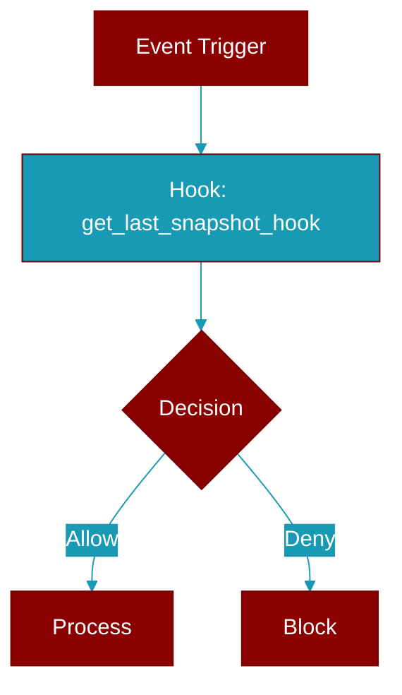

<div className="flex items-center gap-2">
  <Badge color="purple">Method</Badge>
</div>

> This is a method of the [**ContextManager**](../classes/ContextManager) class in the [**manager**](../modules/manager) module.

Get the last LLM boundary snapshot.



## Signature

```python
def get_last_snapshot_hook() -> Optional[SnapshotHookData]
```

### Returns

<ResponseField name="Returns" type="Optional[SnapshotHookData]">
  The result of the operation.
</ResponseField>
