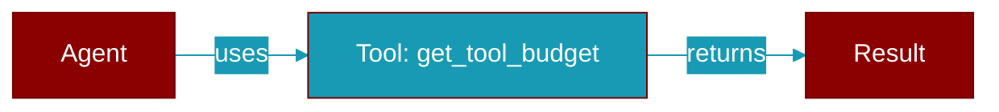

# get_tool_budget

<div className="flex items-center gap-2">
  <Badge color="purple">Method</Badge>
</div>

> This is a method of the [**ContextManager**](../classes/ContextManager) class in the [**manager**](../modules/manager) module.

Get token budget for a specific tool.



## Signature

```python
def get_tool_budget(tool_name: str) -> int
```

## Parameters

<ParamField query="tool_name" type="str" required={true}>
  No description available.
</ParamField>

### Returns

<ResponseField name="Returns" type="int">
  The result of the operation.
</ResponseField>
