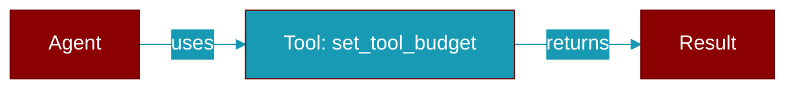

<div className="flex items-center gap-2">
  <Badge color="purple">Method</Badge>
</div>

> This is a method of the [**ContextManager**](../classes/ContextManager) class in the [**manager**](../modules/manager) module.

Set token budget for a specific tool.



## Signature

```python
def set_tool_budget(tool_name: str, max_tokens: int, protected: bool) -> None
```

## Parameters

<ParamField query="tool_name" type="str" required={true}>
  No description available.
</ParamField>

<ParamField query="max_tokens" type="int" required={true}>
  No description available.
</ParamField>

<ParamField query="protected" type="bool" required={false} default="False">
  No description available.
</ParamField>
