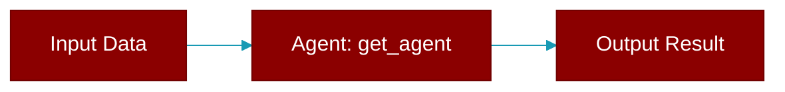

<div className="flex items-center gap-2">
  <Badge color="purple">Method</Badge>
</div>

> This is a method of the [**GatewayProtocol**](../classes/GatewayProtocol) class in the [**protocols**](../modules/protocols) module.

Get a registered agent by ID.



## Signature

```python
def get_agent(agent_id: str) -> Optional['Agent']
```

## Parameters

<ParamField query="agent_id" type="str" required={true}>
  No description available.
</ParamField>

### Returns

<ResponseField name="Returns" type="Optional['Agent']">
  The result of the operation.
</ResponseField>
