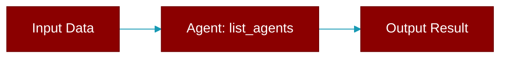

<div className="flex items-center gap-2">
  <Badge color="purple">Method</Badge>
</div>

> This is a method of the [**GatewayProtocol**](../classes/GatewayProtocol) class in the [**protocols**](../modules/protocols) module.

List all registered agent IDs.



## Signature

```python
def list_agents() -> List[str]
```

### Returns

<ResponseField name="Returns" type="List[str]">
  The result of the operation.
</ResponseField>
