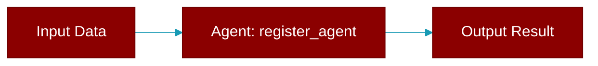

# register_agent

<div className="flex items-center gap-2">
  <Badge color="purple">Method</Badge>
</div>

> This is a method of the [**GatewayProtocol**](../classes/GatewayProtocol) class in the [**protocols**](../modules/protocols) module.

Register an agent with the gateway.



## Signature

```python
def register_agent(agent: 'Agent', agent_id: Optional[str]) -> str
```

## Parameters

<ParamField query="agent" type="Agent" required={true}>
  The agent to register
</ParamField>

<ParamField query="agent_id" type="Optional" required={false}>
  Optional custom agent ID
</ParamField>

### Returns

<ResponseField name="Returns" type="str">
  The agent ID (generated if not provided)
</ResponseField>
