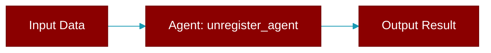

# unregister_agent

<div className="flex items-center gap-2">
  <Badge color="purple">Method</Badge>
</div>

> This is a method of the [**GatewayProtocol**](../classes/GatewayProtocol) class in the [**protocols**](../modules/protocols) module.

Unregister an agent from the gateway.



## Signature

```python
def unregister_agent(agent_id: str) -> bool
```

## Parameters

<ParamField query="agent_id" type="str" required={true}>
  The agent ID to unregister
</ParamField>

### Returns

<ResponseField name="Returns" type="bool">
  True if agent was unregistered, False if not found
</ResponseField>
