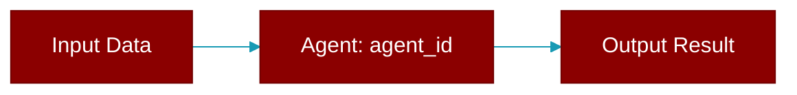

<div className="flex items-center gap-2">
  <Badge color="purple">Method</Badge>
</div>

> This is a method of the [**GatewaySessionProtocol**](../classes/GatewaySessionProtocol) class in the [**protocols**](../modules/protocols) module.

ID of the agent handling this session.



## Signature

```python
def agent_id() -> Optional[str]
```

### Returns

<ResponseField name="Returns" type="Optional[str]">
  The result of the operation.
</ResponseField>
