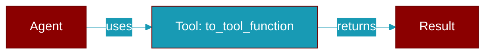

<div className="flex items-center gap-2">
  <Badge color="purple">Method</Badge>
</div>

> This is a method of the [**Handoff**](../classes/Handoff) class in the [**handoff**](../modules/handoff) module.

Convert this handoff to a tool function that can be called by the LLM.



## Signature

```python
def to_tool_function(source_agent: 'Agent') -> Callable
```

## Parameters

<ParamField query="source_agent" type="Agent" required={true}>
  The agent that will be using this handoff
</ParamField>

### Returns

<ResponseField name="Returns" type="Callable">
  A callable function that performs the handoff
</ResponseField>
