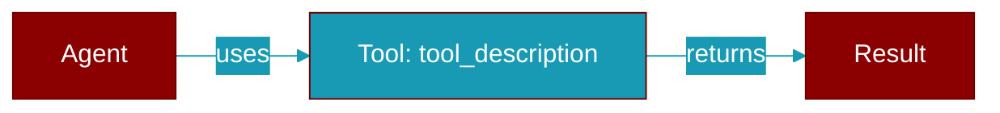

<div className="flex items-center gap-2">
  <Badge color="purple">Method</Badge>
</div>

> This is a method of the [**Handoff**](../classes/Handoff) class in the [**handoff**](../modules/handoff) module.

Get the tool description for this handoff.



## Signature

```python
def tool_description() -> str
```

### Returns

<ResponseField name="Returns" type="str">
  The result of the operation.
</ResponseField>
