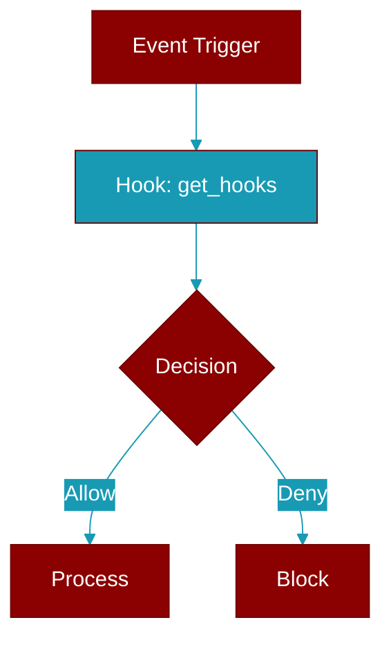

# get_hooks

<div className="flex items-center gap-2">
  <Badge color="purple">Method</Badge>
</div>

> This is a method of the [**HookRegistry**](../classes/HookRegistry) class in the [**registry**](../modules/registry) module.

Get all hooks for an event, optionally filtered by target.



## Signature

```python
def get_hooks(event: HookEvent, target: Optional[str]) -> List[HookDefinition]
```

## Parameters

<ParamField query="event" type="HookEvent" required={true}>
  The event to get hooks for
</ParamField>

<ParamField query="target" type="Optional" required={false}>
  Optional target to filter by (e.g., tool name)
</ParamField>

### Returns

<ResponseField name="Returns" type="List[HookDefinition]">
  List of matching hook definitions
</ResponseField>


---

## Related Documentation

<CardGroup cols={2}>
  <Card title="Hooks Concept" icon="anchor" href="/docs/concepts/hooks" />
  <Card title="Hook Events" icon="bolt" href="/docs/features/hook-events" />
  <Card title="Callbacks" icon="phone" href="/docs/features/callbacks" />
</CardGroup>
