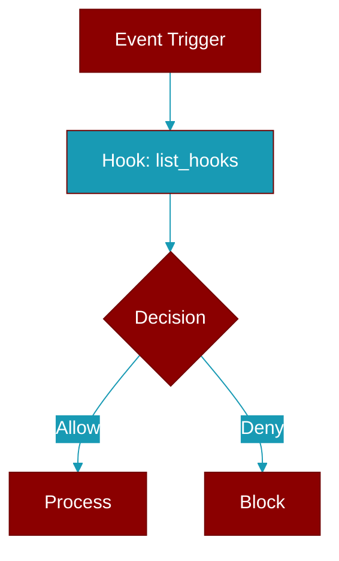

<div className="flex items-center gap-2">
  <Badge color="purple">Method</Badge>
</div>

> This is a method of the [**HookRegistry**](../classes/HookRegistry) class in the [**registry**](../modules/registry) module.

List all registered hooks.



## Signature

```python
def list_hooks() -> Dict[str, List[Dict]]
```

### Returns

<ResponseField name="Returns" type="Dict[str, List[Dict]]">
  Dictionary mapping event names to hook info
</ResponseField>
