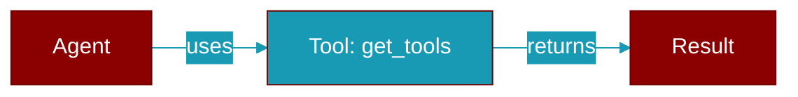

# get_tools

<div className="flex items-center gap-2">
  <Badge color="purple">Method</Badge>
</div>

> This is a method of the [**MCP**](../classes/MCP) class in the [**mcp**](../modules/mcp) module.

Get the list of tool functions from this MCP instance.

This method provides explicit access to the tools list, which is useful
when you need to inspect or manipulate the tools programmatically.



## Signature

```python
def get_tools() -> List[Callable]
```

### Returns

<ResponseField name="Returns" type="List[Callable]">
  List of tool functions that can be called
</ResponseField>

## Usage

```python
mcp = MCP("npx -y @modelcontextprotocol/server-time")
    tools = mcp.get_tools()
    for tool in tools:
        print(f"Tool: {tool.__name__}")
```


---

## Related Documentation

<CardGroup cols={2}>
  <Card title="Tools Concept" icon="wrench" href="/docs/concepts/tools" />
  <Card title="Create Custom Tools" icon="plus" href="/docs/guides/tools/create-custom-tools" />
  <Card title="Tool Development" icon="code" href="/docs/tutorials/advanced-tool-development" />
</CardGroup>
