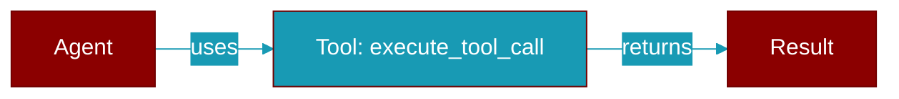

# execute_tool_call

<div className="flex items-center gap-2">
  <Badge color="purple">Method</Badge>
</div>

> This is a method of the [**MiddlewareManager**](../classes/MiddlewareManager) class in the [**middleware**](../modules/middleware) module.

Execute a tool call with all hooks and middleware.

Order:
1. before_tool hooks (in order)
2. wrap_tool_call middleware chain
3. actual tool call
4. after_tool hooks (in reverse order)



## Signature

```python
def execute_tool_call(request: ToolRequest, tool_fn: Callable[[ToolRequest], ToolResponse]) -> ToolResponse
```

## Parameters

<ParamField query="request" type="ToolRequest" required={true}>
  No description available.
</ParamField>

<ParamField query="tool_fn" type="Callable" required={true}>
  No description available.
</ParamField>

### Returns

<ResponseField name="Returns" type="ToolResponse">
  The result of the operation.
</ResponseField>
