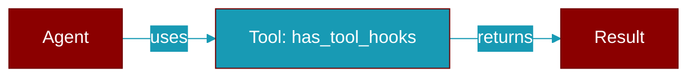

# has_tool_hooks

<div className="flex items-center gap-2">
  <Badge color="purple">Method</Badge>
</div>

> This is a method of the [**MiddlewareManager**](../classes/MiddlewareManager) class in the [**middleware**](../modules/middleware) module.

Check if any tool hooks are registered.



## Signature

```python
def has_tool_hooks() -> bool
```

### Returns

<ResponseField name="Returns" type="bool">
  The result of the operation.
</ResponseField>


## Source

<Card title="View on GitHub" icon="github" href="https://github.com/MervinPraison/PraisonAI/blob/main/src/praisonai-agents/praisonaiagents/hooks/middleware.py#L353">
  `praisonaiagents/hooks/middleware.py` at line 353
</Card>


---

## Related Documentation

<CardGroup cols={2}>
  <Card title="Tools Concept" icon="wrench" href="/docs/concepts/tools" />
  <Card title="Create Custom Tools" icon="plus" href="/docs/guides/tools/create-custom-tools" />
  <Card title="Tool Development" icon="code" href="/docs/tutorials/advanced-tool-development" />
  <Card title="Hooks Concept" icon="anchor" href="/docs/concepts/hooks" />
  <Card title="Hook Events" icon="bolt" href="/docs/features/hook-events" />
</CardGroup>
