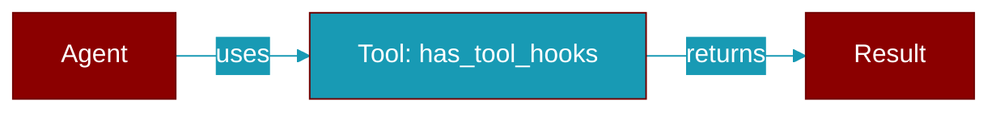

# has_tool_hooks

<div className="flex items-center gap-2">
  <Badge color="purple">Method</Badge>
</div>

> This is a method of the [**MiddlewareManager**](../classes/MiddlewareManager) class in the [**middleware**](../modules/middleware) module.

Check if any tool hooks are registered.



## Signature

```python
def has_tool_hooks() -> bool
```

### Returns

<ResponseField name="Returns" type="bool">
  The result of the operation.
</ResponseField>
