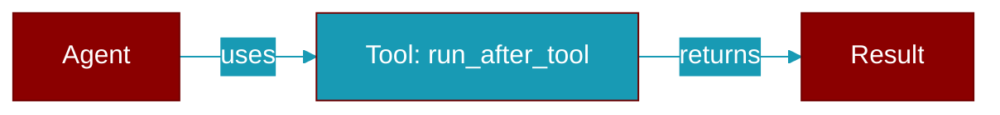

# run_after_tool

<div className="flex items-center gap-2">
  <Badge color="purple">Method</Badge>
</div>

> This is a method of the [**MiddlewareManager**](../classes/MiddlewareManager) class in the [**middleware**](../modules/middleware) module.

Run all after_tool hooks (in reverse order).



## Signature

```python
def run_after_tool(response: ToolResponse) -> ToolResponse
```

## Parameters

<ParamField query="response" type="ToolResponse" required={true}>
  No description available.
</ParamField>

### Returns

<ResponseField name="Returns" type="ToolResponse">
  The result of the operation.
</ResponseField>


## Uses

- `hook`


## Used By

- [`MiddlewareManager.execute_tool_call`](../functions/MiddlewareManager-execute_tool_call)


## Source

<Card title="View on GitHub" icon="github" href="https://github.com/MervinPraison/PraisonAI/blob/main/src/praisonai-agents/praisonaiagents/hooks/middleware.py#L379">
  `praisonaiagents/hooks/middleware.py` at line 379
</Card>


---

## Related Documentation

<CardGroup cols={2}>
  <Card title="Tools Concept" icon="wrench" href="/docs/concepts/tools" />
  <Card title="Create Custom Tools" icon="plus" href="/docs/guides/tools/create-custom-tools" />
  <Card title="Tool Development" icon="code" href="/docs/tutorials/advanced-tool-development" />
</CardGroup>
