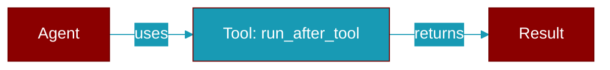

# run_after_tool

<div className="flex items-center gap-2">
  <Badge color="purple">Method</Badge>
</div>

> This is a method of the [**MiddlewareManager**](../classes/MiddlewareManager) class in the [**middleware**](../modules/middleware) module.

Run all after_tool hooks (in reverse order).



## Signature

```python
def run_after_tool(response: ToolResponse) -> ToolResponse
```

## Parameters

<ParamField query="response" type="ToolResponse" required={true}>
  No description available.
</ParamField>

### Returns

<ResponseField name="Returns" type="ToolResponse">
  The result of the operation.
</ResponseField>
