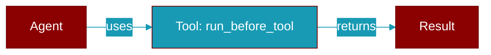

# run_before_tool

<div className="flex items-center gap-2">
  <Badge color="purple">Method</Badge>
</div>

> This is a method of the [**MiddlewareManager**](../classes/MiddlewareManager) class in the [**middleware**](../modules/middleware) module.

Run all before_tool hooks.



## Signature

```python
def run_before_tool(request: ToolRequest) -> ToolRequest
```

## Parameters

<ParamField query="request" type="ToolRequest" required={true}>
  No description available.
</ParamField>

### Returns

<ResponseField name="Returns" type="ToolRequest">
  The result of the operation.
</ResponseField>
