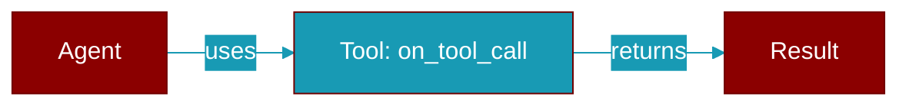

<div className="flex items-center gap-2">
  <Badge color="purple">Method</Badge>
</div>

> This is a method of the [**ObservabilityAdapter**](../classes/ObservabilityAdapter) class in the [**obs**](../modules/obs) module.

Called when a tool is invoked.



## Signature

```python
def on_tool_call(span_id: str, tool_name: str, args: Dict[str, Any], result: Any, latency_ms: Optional[float]) -> None
```

## Parameters

<ParamField query="span_id" type="str" required={true}>
  No description available.
</ParamField>

<ParamField query="tool_name" type="str" required={true}>
  No description available.
</ParamField>

<ParamField query="args" type="Dict" required={true}>
  No description available.
</ParamField>

<ParamField query="result" type="Any" required={true}>
  No description available.
</ParamField>

<ParamField query="latency_ms" type="Optional" required={false}>
  No description available.
</ParamField>
