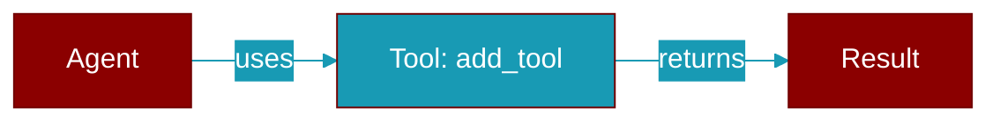

# add_tool

<div className="flex items-center gap-2">
  <Badge color="purple">Method</Badge>
</div>

> This is a method of the [**PermissionAllowlist**](../classes/PermissionAllowlist) class in the [**approval**](../modules/approval) module.

Add a tool to the allowlist.



## Signature

```python
def add_tool(tool_name: str, paths: Optional[List[str]], session_only: bool) -> None
```

## Parameters

<ParamField query="tool_name" type="str" required={true}>
  Name of the tool to allow
</ParamField>

<ParamField query="paths" type="Optional" required={false}>
  Optional list of allowed paths (empty = all paths)
</ParamField>

<ParamField query="session_only" type="bool" required={false} default="False">
  If True, permission expires with session
</ParamField>
