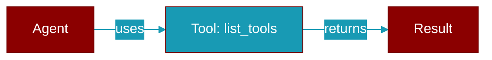

# list_tools

<div className="flex items-center gap-2">
  <Badge color="purple">Method</Badge>
</div>

> This is a method of the [**PermissionAllowlist**](../classes/PermissionAllowlist) class in the [**approval**](../modules/approval) module.

List all allowed tools.



## Signature

```python
def list_tools() -> List[str]
```

### Returns

<ResponseField name="Returns" type="List[str]">
  The result of the operation.
</ResponseField>


## Source

<Card title="View on GitHub" icon="github" href="https://github.com/MervinPraison/PraisonAI/blob/main/src/praisonai-agents/praisonaiagents/approval.py#L166">
  `praisonaiagents/approval.py` at line 166
</Card>


---

## Related Documentation

<CardGroup cols={2}>
  <Card title="Tools Concept" icon="wrench" href="/docs/concepts/tools" />
  <Card title="Create Custom Tools" icon="plus" href="/docs/guides/tools/create-custom-tools" />
  <Card title="Tool Development" icon="code" href="/docs/tutorials/advanced-tool-development" />
</CardGroup>
