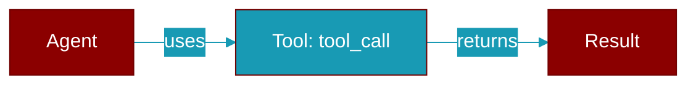

# tool_call

<div className="flex items-center gap-2">
  <Badge color="purple">Method</Badge>
</div>

> This is a method of the [**ScriptedModel**](../classes/ScriptedModel) class in the [**scripted**](../modules/scripted) module.

Script a turn in which the model calls one tool.



## Signature

```python
def tool_call(name: str, arguments: Optional[Dict[str, Any]]) -> ScriptedReply
```

## Parameters

<ParamField query="name" type="str" required={true}>
  Tool function name.
</ParamField>

<ParamField query="arguments" type="Optional" required={false}>
  Arguments to call it with.
</ParamField>

### Returns

<ResponseField name="Returns" type="ScriptedReply">
  class:`ScriptedReply` to put in the script.
</ResponseField>


## Uses

- `ScriptedReply`
- `ScriptedToolCall`


## Source

<Card title="View on GitHub" icon="github" href="https://github.com/MervinPraison/PraisonAI/blob/main/src/praisonai-agents/praisonaiagents/model_harness/scripted.py#L311">
  `praisonaiagents/model_harness/scripted.py` at line 311
</Card>


---

## Related Documentation

<CardGroup cols={2}>
  <Card title="Tools Concept" icon="wrench" href="/docs/concepts/tools" />
  <Card title="Create Custom Tools" icon="plus" href="/docs/guides/tools/create-custom-tools" />
  <Card title="Tool Development" icon="code" href="/docs/tutorials/advanced-tool-development" />
</CardGroup>
