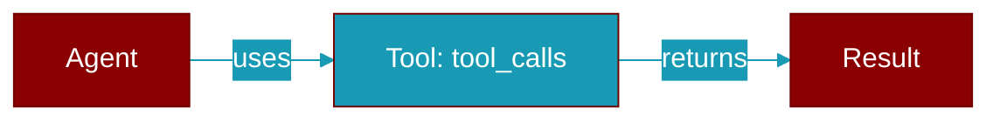

# tool_calls

<div className="flex items-center gap-2">
  <Badge color="purple">Method</Badge>
</div>

> This is a method of the [**ScriptedModel**](../classes/ScriptedModel) class in the [**scripted**](../modules/scripted) module.

Script a turn in which the model calls several tools at once.



## Signature

```python
def tool_calls() -> ScriptedReply
```

### Returns

<ResponseField name="Returns" type="ScriptedReply">
  class:`ScriptedReply` carrying all of them.
</ResponseField>


## Uses

- `ScriptedReply`


## Source

<Card title="View on GitHub" icon="github" href="https://github.com/MervinPraison/PraisonAI/blob/main/src/praisonai-agents/praisonaiagents/model_harness/scripted.py#L329">
  `praisonaiagents/model_harness/scripted.py` at line 329
</Card>


---

## Related Documentation

<CardGroup cols={2}>
  <Card title="Tools Concept" icon="wrench" href="/docs/concepts/tools" />
  <Card title="Create Custom Tools" icon="plus" href="/docs/guides/tools/create-custom-tools" />
  <Card title="Tool Development" icon="code" href="/docs/tutorials/advanced-tool-development" />
</CardGroup>
