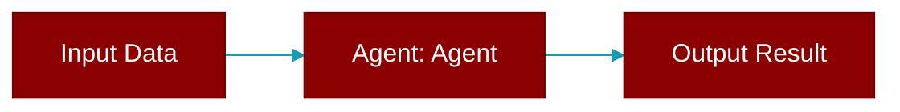

# Agent

<div className="flex items-center gap-2">
  <Badge color="purple">Method</Badge>
</div>

> This is a method of the [**Session**](../classes/Session) class in the [**session**](../modules/session) module.

Create an agent with session context.



## Signature

```python
def Agent(name: str, role: str, instructions: Optional[str], tools: Optional[List[Any]], memory: bool, knowledge: Optional[List[str]]) -> Agent
```

## Parameters

<ParamField query="name" type="str" required={true}>
  Agent name
</ParamField>

<ParamField query="role" type="str" required={false} default="'Assistant'">
  Agent role
</ParamField>

<ParamField query="instructions" type="Optional" required={false}>
  Agent instructions
</ParamField>

<ParamField query="tools" type="Optional" required={false}>
  List of tools for the agent
</ParamField>

<ParamField query="memory" type="bool" required={false} default="True">
  Enable memory for the agent
</ParamField>

<ParamField query="knowledge" type="Optional" required={false}>
  Knowledge sources for the agent **kwargs: Additional agent parameters
</ParamField>

### Returns

<ResponseField name="Returns" type="Agent">
  Configured Agent instance
</ResponseField>

### Exceptions

<AccordionGroup>
  <Accordion title="ValueError">
    If this is a remote session (use chat() instead)
  </Accordion>
</AccordionGroup>
