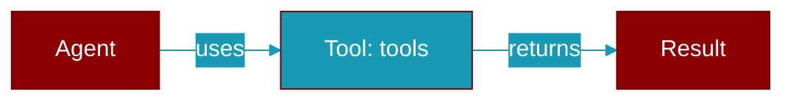

# tools

<div className="flex items-center gap-2">
  <Badge color="purple">Method</Badge>
</div>

> This is a method of the [**ToolAwareAgentProtocol**](../classes/ToolAwareAgentProtocol) class in the [**protocols**](../modules/protocols) module.

List of tools available to the agent.



## Signature

```python
def tools() -> List[Any]
```

### Returns

<ResponseField name="Returns" type="List[Any]">
  The result of the operation.
</ResponseField>


## Source

<Card title="View on GitHub" icon="github" href="https://github.com/MervinPraison/PraisonAI/blob/main/src/praisonai-agents/praisonaiagents/agent/protocols.py#L129">
  `praisonaiagents/agent/protocols.py` at line 129
</Card>


---

## Related Documentation

<CardGroup cols={2}>
  <Card title="Tools Concept" icon="wrench" href="/docs/concepts/tools" />
  <Card title="Create Custom Tools" icon="plus" href="/docs/guides/tools/create-custom-tools" />
  <Card title="Tool Development" icon="code" href="/docs/tutorials/advanced-tool-development" />
</CardGroup>
