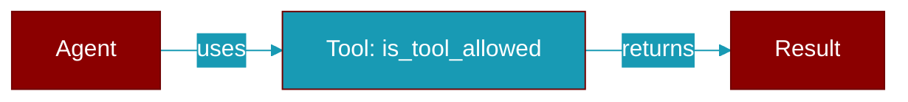

# is_tool_allowed

<div className="flex items-center gap-2">
  <Badge color="purple">Method</Badge>
</div>

> This is a method of the [**ToolPolicy**](../classes/ToolPolicy) class in the [**protocols**](../modules/protocols) module.

Return ``True`` if ``tool`` may be exposed on this route.



## Signature

```python
def is_tool_allowed(tool: Any) -> bool
```

## Parameters

<ParamField query="tool" type="Any" required={true}>
  No description available.
</ParamField>

### Returns

<ResponseField name="Returns" type="bool">
  The result of the operation.
</ResponseField>


## Used By

- [`ToolPolicy.filter_tools`](../functions/ToolPolicy-filter_tools)


## Source

<Card title="View on GitHub" icon="github" href="https://github.com/MervinPraison/PraisonAI/blob/main/src/praisonai-agents/praisonaiagents/gateway/protocols.py#L1900">
  `praisonaiagents/gateway/protocols.py` at line 1900
</Card>


---

## Related Documentation

<CardGroup cols={2}>
  <Card title="Tools Concept" icon="wrench" href="/docs/concepts/tools" />
  <Card title="Create Custom Tools" icon="plus" href="/docs/guides/tools/create-custom-tools" />
  <Card title="Tool Development" icon="code" href="/docs/tutorials/advanced-tool-development" />
</CardGroup>
