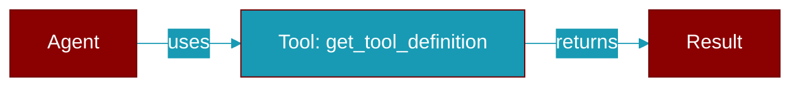

# get_tool_definition

<div className="flex items-center gap-2">
  <Badge color="purple">Method</Badge>
</div>

> This is a method of the [**ToolRegistry**](../classes/ToolRegistry) class in the [**registry**](../modules/registry) module.

Get the effective OpenAI-compatible definition for one registered name.

Unlike :meth:`get`, which returns the raw tool object, this applies any
dynamic ``schema_override`` (via ``ToolEntry.schema``) and forces the
advertised ``function.name`` to the registry key, so a callable
registered under an alias is offered — and later resolved — under that
alias rather than its underlying ``__name__``.

Returns ``None`` if the name is unknown or unavailable.



## Signature

```python
def get_tool_definition(name: str) -> Optional[Dict[str, Any]]
```

## Parameters

<ParamField query="name" type="str" required={true}>
  No description available.
</ParamField>

### Returns

<ResponseField name="Returns" type="Optional[Dict[str, Any]]">
  The result of the operation.
</ResponseField>


## Uses

- `discover_plugins`
- `logging.error`


## Source

<Card title="View on GitHub" icon="github" href="https://github.com/MervinPraison/PraisonAI/blob/main/src/praisonai-agents/praisonaiagents/tools/registry.py#L307">
  `praisonaiagents/tools/registry.py` at line 307
</Card>


---

## Related Documentation

<CardGroup cols={2}>
  <Card title="Tools Concept" icon="wrench" href="/docs/concepts/tools" />
  <Card title="Create Custom Tools" icon="plus" href="/docs/guides/tools/create-custom-tools" />
  <Card title="Tool Development" icon="code" href="/docs/tutorials/advanced-tool-development" />
</CardGroup>
