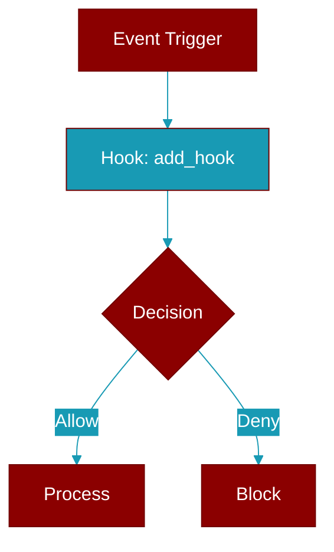

<div className="flex items-center gap-2">
  <Badge color="teal">Function</Badge>
</div>

> This function is defined in the [**registry**](../modules/registry) module.

Register a hook callback. Simplified API.

Accepts both string event names and HookEvent enums:
    add_hook('before_tool', my_callback)  # String
    add_hook(HookEvent.BEFORE_TOOL, my_callback)  # Enum

Can also be used as a decorator:
    @add_hook('before_tool')
    def my_hook(data):
        return HookResult.allow()



## Signature

```python
def add_hook(event: Union[str, HookEvent], callback: Optional[Callable[[HookInput], HookResult]], priority: int, matcher: Optional[str]) -> Union[str, Callable]
```

## Parameters

<ParamField query="event" type="Union" required={true}>
  Hook event name ('before_tool', 'after_llm', etc.) or HookEvent enum
</ParamField>

<ParamField query="callback" type="Optional" required={false}>
  Function to call when hook fires (optional when using as decorator)
</ParamField>

<ParamField query="priority" type="int" required={false} default="10">
  Execution order (lower = earlier). Default 10. (Reserved for future use)
</ParamField>

<ParamField query="matcher" type="Optional" required={false}>
  Optional regex pattern to match specific targets (e.g., tool names)
</ParamField>

### Returns

<ResponseField name="Returns" type="Union[str, Callable]">
  Hook ID for later removal, or a decorator function if callback is None
</ResponseField>

### Exceptions

<AccordionGroup>
  <Accordion title="ValueError">
    If event string is not a valid HookEvent
  </Accordion>
</AccordionGroup>
