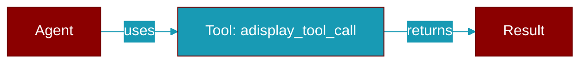

<div className="flex items-center gap-2">
  <Badge color="blue">Async</Badge>
  <Badge color="teal">Function</Badge>
</div>

> This function is defined in the [**main**](../modules/main) module.

Async version of display_tool_call.



## Signature

```python
async def adisplay_tool_call(message: str, console: Any) -> Any
```

## Parameters

<ParamField query="message" type="str" required={true}>
  No description available.
</ParamField>

<ParamField query="console" type="Any" required={false}>
  No description available.
</ParamField>

### Returns

<ResponseField name="Returns" type="Any">
  The result of the operation.
</ResponseField>
