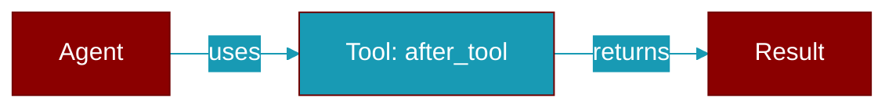

# after_tool

<div className="flex items-center gap-2">
  <Badge color="teal">Function</Badge>
</div>

> This function is defined in the [**middleware**](../modules/middleware) module.

Decorator to mark a function as an after_tool hook.

The function receives a ToolResponse and should return a (possibly modified) ToolResponse.



## Signature

```python
def after_tool(func: AfterToolFn) -> AfterToolFn
```

## Parameters

<ParamField query="func" type="AfterToolFn" required={true}>
  No description available.
</ParamField>

### Returns

<ResponseField name="Returns" type="AfterToolFn">
  The result of the operation.
</ResponseField>

## Usage

```python
@after_tool
    def log_result(response):
        print(f"Tool {response.tool_name} returned: {response.result}")
        return response
```


## Source

<Card title="View on GitHub" icon="github" href="https://github.com/MervinPraison/PraisonAI/blob/main/src/praisonai-agents/praisonaiagents/hooks/middleware.py#L257">
  `praisonaiagents/hooks/middleware.py` at line 257
</Card>


---

## Related Documentation

<CardGroup cols={2}>
  <Card title="Tools Concept" icon="wrench" href="/docs/concepts/tools" />
  <Card title="Create Custom Tools" icon="plus" href="/docs/guides/tools/create-custom-tools" />
  <Card title="Tool Development" icon="code" href="/docs/tutorials/advanced-tool-development" />
</CardGroup>
