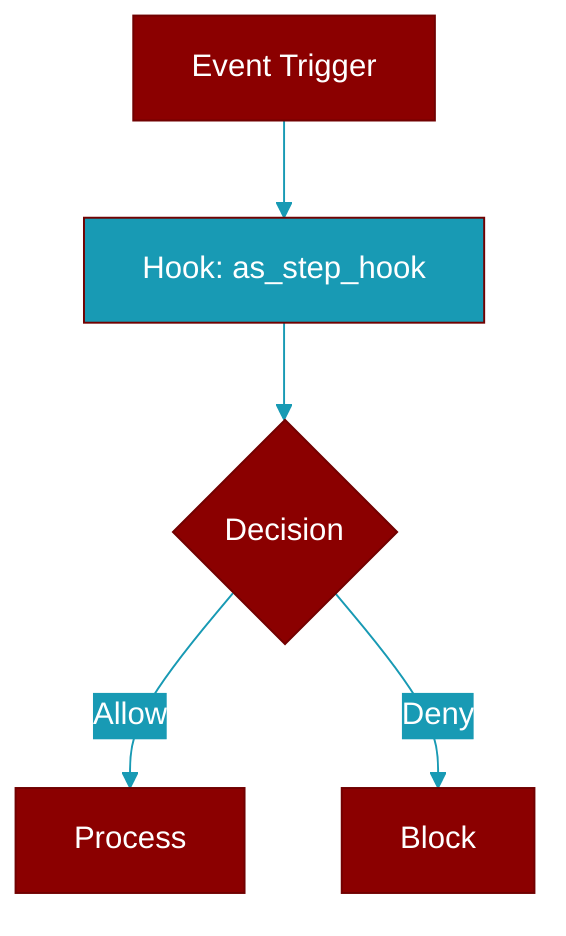

# as_step_hook

<div className="flex items-center gap-2">
  <Badge color="teal">Function</Badge>
</div>

> This function is defined in the [**middleware**](../modules/middleware) module.

Adapt a plain ``on_step`` callback into an ``after_model`` middleware hook.

``HooksConfig(on_step=...)`` advertises "called once per agent step". An
agent step is one model call, so the callback is routed onto the existing
``after_model`` middleware slot: it is invoked with the :class:`ModelResponse`
for the step and its return value is ignored (the response passes through
unchanged, so an observer can never corrupt the run).



## Signature

```python
def as_step_hook(callback: Callable[[Any], Any]) -> AfterModelFn
```

## Parameters

<ParamField query="callback" type="Callable" required={true}>
  No description available.
</ParamField>

### Returns

<ResponseField name="Returns" type="AfterModelFn">
  The result of the operation.
</ResponseField>


## Source

<Card title="View on GitHub" icon="github" href="https://github.com/MervinPraison/PraisonAI/blob/main/src/praisonai-agents/praisonaiagents/hooks/middleware.py#L318">
  `praisonaiagents/hooks/middleware.py` at line 318
</Card>


---

## Related Documentation

<CardGroup cols={2}>
  <Card title="Hooks Concept" icon="anchor" href="/docs/concepts/hooks" />
  <Card title="Hook Events" icon="bolt" href="/docs/features/hook-events" />
  <Card title="Callbacks" icon="phone" href="/docs/features/callbacks" />
</CardGroup>
